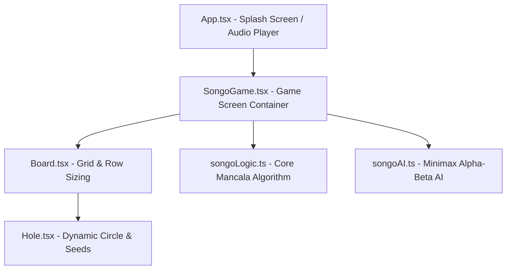

# 🎮 Songo - Jeu Traditionnel Africain

<p align="center">
  
</p>

Bienvenue dans le projet **Songo**, une adaptation moderne en **React Native** du célèbre jeu de société traditionnel d'Afrique Centrale (appartenant à la famille des Mancalas). Ce projet allie une esthétique boisée et dorée premium à une jouabilité fluide et entièrement responsive, accompagnée d'un système audio personnalisé et dynamique.

---

## 📸 Identité Visuelle & Logo Premium

L'application arbore une identité visuelle luxueuse s'inspirant des plateaux de Songo traditionnels taillés dans des bois précieux.

### 🌟 Le Logo 3D
<p align="left">
  
</p>

* **Fichier Source** : [logo.png](file:///home/ravel/Documents/CODES/songo/src/assets/logo.png)
* **Description** : Un pion circulaire en bois d'acajou poli verni, serti d'un liseré doré brillant, abritant des cavités sculptées remplies de graines dorées étincelantes.
* **Écran de chargement (Splash Screen)** : Au lancement de l'application, ce logo apparaît au centre d'un fond sombre luxueux (`#0F0804`) avec un effet de fondu et de zoom progressif, suivi d'une animation d'entrée pour le titre et d'un indicateur de chargement rotatif doré. Le contenu a été ajusté avec un espacement supérieur pour un rendu visuel centré et parfaitement équilibré.

### 🛡️ Icônes Android Anti-Fond Blanc (`generate_icons.py`)
* **Fichier de Génération** : [generate_icons.py](file:///home/ravel/Documents/CODES/songo/scratch/generate_icons.py)
* Sur les versions modernes d'Android, les icônes sans transparence sont automatiquement enveloppées d'une bordure ou d'un carré blanc disgracieux par le système.
* **Solution implémentée** : Notre script Python applique un masque circulaire de rayon `445px` centré sur le logo de 1024px pour extraire uniquement le pion en bois précieux. Il le dépose sur un canevas **100% transparent** (`RGBA`) avec une marge de sécurité de 8% pour éviter les rognages système.
* Le script génère et remplace automatiquement les icônes standards (`ic_launcher.png`) et rondes (`ic_launcher_round.png`) pour toutes les densités d'affichage Android dans `android/app/src/main/res/mipmap-*`.

---

## 🎵 Système Audio Dynamique (`npm run song`)

Le jeu propose une ambiance musicale immersive avec des musiques de fond qui se lancent de façon aléatoire et en boucle à l'ouverture de l'application.

### 📂 Comment ajouter vos propres musiques ?
1. Déposez simplement vos fichiers audio (au format `.mp3`, `.wav`, `.ogg`, `.webm`, etc.) dans le dossier racine : [songs/](file:///home/ravel/Documents/CODES/songo/songs/).
2. Lancez la commande suivante dans votre terminal :
   ```bash
   npm run song
   ```
3. **Ce que fait le script automatiquement (`copy_songs.py`)** :
   * Il crée les dossiers nécessaires s'ils n'existent pas.
   * Il scanne vos fichiers et **les sanitise pour Android** (les noms des ressources Android doivent être en minuscules, sans espaces, et ne contenir que des lettres, chiffres et underscores). Par exemple : `"My Song.mp3"` devient `"my_song.mp3"`.
   * Il copie les fichiers directement dans le dossier des ressources natives d'Android : `android/app/src/main/res/raw/`.
   * Il génère et met à jour dynamiquement un fichier d'indexation : [songsList.json](file:///home/ravel/Documents/CODES/songo/src/assets/songsList.json) permettant à la couche JavaScript de connaître en temps réel les pistes disponibles.

### 🔊 Contrôle du volume à l'écran
Un bouton flottant semi-transparent (`🔊` / `🔇`) s'affiche discrètement en haut à droite de l'écran (sur l'écran de chargement et pendant la partie) pour permettre au joueur de couper ou réactiver la musique instantanément à tout moment.

---

## 📐 Design Entièrement Responsive

* **Fichiers concernés** : [Board.tsx](file:///home/ravel/Documents/CODES/songo/src/components/Board.tsx) et [Hole.tsx](file:///home/ravel/Documents/CODES/songo/src/components/Hole.tsx)
* **Problématique d'origine** : Sur les petits écrans de téléphone (360px - 410px), le plateau débordait horizontalement et le joueur ne voyait que 5 trous par ligne au lieu des 7 requis pour jouer au Songo.
* **Solution Mathématique Implémentée** :
  * Nous utilisons le hook `useWindowDimensions()` de React Native dans [Board.tsx](file:///home/ravel/Documents/CODES/songo/src/components/Board.tsx) pour récupérer la largeur de l'écran en temps réel.
  * Le plateau calcule sa largeur optimale (`boardWidth = Math.min(screenWidth - 32, 600)`), s'ajustant automatiquement lors des rotations d'écran tout en restant élégamment dimensionné sur tablette.
  * L'espace horizontal disponible pour les trous est calculé après déduction des paddings et marges adaptatives.
  * La taille de chaque trou (`size={holeSize}`) est calculée dynamiquement pour s'assurer que **les 7 trous tiennent exactement sur une seule ligne** sans jamais déborder (ex: `37px` sur un écran de 375px de large, et bridé à un maximum confortable de `60px` sur tablette/grand écran).
  * Les composants internes dans [Hole.tsx](file:///home/ravel/Documents/CODES/songo/src/components/Hole.tsx) (la taille des graines, les espacements, la taille de police du score et son décalage vertical) se redimensionnent de manière parfaitement proportionnelle à la taille calculée du trou !

---

## 🧠 Architecture du Code & Logique de Jeu

Le jeu Songo repose sur une séparation claire entre la couche de présentation (React Native) et la couche de logique algorithmique pure (TypeScript).



### 🤖 Mode Solo - Intelligence Artificielle Tactique (`songoAI.ts`)

Pour offrir un défi captivant aux joueurs solos, le jeu intègre une IA redoutable qui calcule ses coups en temps réel.

#### Algorithme de Recherche (Minimax & Alpha-Bêta)
L'IA utilise l'algorithme **Minimax** associé à l'**élagage Alpha-Bêta** avec une profondeur d'exploration de **4 plies (coups) à l'avance** :
* **Minimax** : Simule virtuellement toutes les combinaisons possibles de coups (les siens et les contre-attaques de l'utilisateur) jusqu'à anticiper 2 tours complets.
* **Élagage Alpha-Bêta** : Élimine instantanément les branches de l'arbre d'exploration jugées sous-optimales par rapport à une option déjà trouvée, garantissant un choix de coup ultra-performant en moins de 2 millisecondes.

#### Fonction d'Évaluation (Heuristique Songo)
Chaque configuration de plateau virtuelle est évaluée selon une équation pondérée simulant les priorités d'un joueur humain expert :
$$\text{Score} = (\Delta\text{Captures} \times 100) + (\Delta\text{Contrôle} \times 10) - (\text{Vulnérabilités} \times 15)$$

1. **Le Différentiel de Graines Capturées (Poids: 100 / graine)** : L'IA maximise en priorité absolue les coups lui permettant de capturer des graines dans le camp adverse ou de déclencher des prises en cascade.
2. **Le Contrôle de Territoire (Poids: 10 / graine active)** : L'IA comptabilise le nombre de graines actives de son côté par rapport à celui de l'adversaire. Maintenir des graines de son côté assure une plus grande autonomie tactique.
3. **La Prévention de Vulnérabilité (Pénalité: -15 / trou vulnérable)** : Un trou contenant 1 ou 2 graines est vulnérable (car si une graine adverse y atterrit, le trou passe à 2 ou 3, validant une capture). L'IA s'efforce de défendre son propre camp en évitant d'exposer ses trous.

#### ⏱️ Contrôle de Temps et Délai de Réponse Humanoïde
Pour rendre les parties contre l'ordinateur plus immersives, réalistes et dramatiques, l'IA est soumise à deux contraintes de temps strictes :
* **Délai de Réponse Forcé de 10 Secondes** : Quel que soit le temps mis par l'IA pour trouver sa meilleure option (même si le calcul Minimax s'effectue en moins de 2ms), l'ordinateur patiente et "réfléchit" pendant **exactement 10 secondes** avant de jouer son coup. Cela évite un enchaînement trop rapide des coups et imite le rythme naturel d'un adversaire humain qui prend le temps de peser ses options.
* **Sécurité Anti-Blocage et Timeout de 15 Secondes** : Si les calculs de l'algorithme prennent plus de **15 secondes** pour évaluer les combinaisons possibles, une alerte de temporisation s'active. L'algorithme interrompt immédiatement ses calculs de manière asynchrone et joue un **coup valide choisi au hasard** pour assurer la fluidité de la partie et éliminer tout risque de gel ou de ralentissement de l'interface utilisateur.
* **Sécurité Anti-Fuite de Mémoire** : L'implémentation React utilise un système de désabonnement actif (cleanups de hooks) pour détruire et annuler proprement les minuteurs de calcul et de délai si l'utilisateur décide de redémarrer la partie ou de quitter le match pour retourner au menu principal en plein tour de l'IA.

---

### 1. Représentation du Plateau
Le Songo se joue avec un plateau composé de 14 trous (2 rangées de 7 trous). Chaque joueur contrôle la rangée située de son côté.
* Dans le code, le plateau est représenté par un tableau plat de 14 nombres : `board: number[]`.
* **Joueur 1 (Bas)** : Trous de l'index `0` à `6`.
* **Joueur 2 (Haut)** : Trous de l'index `7` à `13`.
* Au début de la partie, chaque trou contient exactement **5 graines** (soit 70 graines au total).

---

### 2. Déplacement des Pions (Semis / Sowing)
* **Fichier** : [songoLogic.ts](file:///home/ravel/Documents/CODES/songo/src/logic/songoLogic.ts)
* **Fonction clé** : `makeMove(state: GameState, holeIndex: number): GameState`
* **Fonctionnement de l'algorithme de déplacement** :
  1. Le joueur actif choisit un de ses trous non vide (`holeIndex`).
  2. Le code récupère toutes les graines de ce trou : `let seeds = nextState.board[holeIndex]` et vide le trou de départ : `nextState.board[holeIndex] = 0`.
  3. Les graines sont distribuées une à une (semées) dans le sens inverse des aiguilles d'une montre (sens anti-horaire) dans les trous suivants en incrémentant l'index : `currentIndex = (currentIndex + 1) % 14`.
  4. Si le nombre de graines est important, le semis continue sur plusieurs tours de plateau.

---

### 3. Logique de Capture (Prise de graines)
* **Fichier** : [songoLogic.ts](file:///home/ravel/Documents/CODES/songo/src/logic/songoLogic.ts) (intégré dans `makeMove`)
* **Règles de capture traditionnelles du Songo** :
  * Une capture est possible uniquement si la **dernière graine** semée tombe dans le territoire de l'adversaire.
  * La capture est valide si le trou d'arrivée contient après le semis **exactement 2 ou 3 graines** (la graine finale comprise).
  * **Capture en cascade** : Si le trou d'arrivée permet une capture, le jeu vérifie le trou précédent (en reculant : `(captureIndex - 1 + 14) % 14`). Si ce trou précédent appartient également à l'adversaire et contient 2 ou 3 graines, ces graines sont aussi capturées. Le processus s'arrête dès qu'un trou ne remplit pas ces conditions ou qu'on sort du territoire adverse.
  * Les graines capturées sont retirées du plateau et ajoutées au score du joueur actif.

---

### 4. Règle Majeure : "Nourrir l'adversaire"
* **Fichier** : [songoLogic.ts](file:///home/ravel/Documents/CODES/songo/src/logic/songoLogic.ts)
* **Fonctions concernées** : `isValidMove`, `wouldFeedOpponent`, `canAnyMoveFeedOpponent`
* **Description** : Si un joueur n'a plus aucune graine dans son territoire (affamé), l'autre joueur a l'obligation stricte de jouer un coup qui lui apporte des graines si un tel coup est possible. Le code simule virtuellement le semis de chaque coup possible pour filtrer et interdire les coups non-nourriciers si un coup nourricier existe. Si aucun coup ne peut nourrir l'adversaire, la partie se termine et le joueur restant ramasse toutes les graines restantes sur son côté.

---

### 5. Gestion des Scores et Fin de Partie
* **Fichiers** : [songoLogic.ts](file:///home/ravel/Documents/CODES/songo/src/logic/songoLogic.ts) et [Board.tsx](file:///home/ravel/Documents/CODES/songo/src/components/Board.tsx)
* **Variables** : `scores: [number, number]` dans le `GameState`.
* **Conditions de victoire** :
  * Le jeu dispose de 70 graines. Un joueur gagne la partie dès qu'il capture **plus de 35 graines** (`scores[player] > 35`).
  * En cas d'égalité exacte (35 - 35), la partie est déclarée nulle (`draw`).
  * Si un joueur ne peut plus jouer de coup valide (bloqué ou affamé sans option), la partie se termine, les graines restantes dans chaque camp sont ajoutées à leurs scores respectifs, et le joueur avec le score le plus élevé l'emporte.

---

### 6. Design System, Couleurs et Thème
* **Fichier** : [theme.ts](file:///home/ravel/Documents/CODES/songo/src/styles/theme.ts)
* Le jeu est architecturé autour d'une palette chaleureuse et boisée pour recréer l'atmosphère d'un vrai jeu de Songo :
  * `COLORS.board` (`#D2B48C` - Tan/Sable) : La structure principale du plateau extérieur.
  * `COLORS.boardHoleContainer` (`#5D2E0B` - Brun Foncé) : L'intérieur sculpté contenant les trous, offrant un excellent contraste.
  * `COLORS.primary` (`#8B4513` - SaddleBrown) : Utilisé pour les trous du Joueur 2.
  * `COLORS.secondary` (`#A0522D` - Sienna) : Utilisé pour les trous du Joueur 1.
  * `COLORS.seed` (`#FFF8DC` - Cornsilk) : La couleur ivoire/beige clair de chaque graine dessinée.
  * `COLORS.gold` (`#FFD700` - Or) : Utilisé pour mettre en surbrillance le joueur actif et le trou sélectionné.

---

### 7. Ressources Natives Utilisées
Pour s'intégrer de façon transparente avec le système d'exploitation Android, l'application utilise plusieurs ressources et API natives de bas niveau :
* **Moteur Audio Natif** : 
  * API utilisée : `android.media.MediaPlayer` (via la bibliothèque native `react-native-sound`).
  * Emplacement des fichiers : `android/app/src/main/res/raw/` où les chansons `.mp3` compilées sont stockées en tant que ressources d'application brutes.
* **Système d'Icônes de l'Application (Mipmaps)** :
  * Emplacement : `android/app/src/main/res/mipmap-*/`
  * Ressources générées : `ic_launcher.png` (icône carrée à bords transparents) et `ic_launcher_round.png` (icône ronde transparente) pour les densités `mdpi`, `hdpi`, `xhdpi`, `xxhdpi`, et `xxxhdpi` gérant l'affichage adaptatif natif sur l'écran d'accueil d'Android.
* **Gestion Native des Barres de Statut (StatusBar)** :
  * API utilisée : Liaison directe avec les attributs de fenêtre native Android `Window.setStatusBarColor()` et `View.setSystemUiVisibility()` (via le composant `<StatusBar>` de React Native) pour colorer nativement la barre d'état système en brun profond (`#0F0804`) et forcer un style d'icônes blanches (`light-content`).
* **Gestion Native des Zones Sécurisées (Safe Area Insets)** :
  * API utilisée : L'API Android native `WindowInsetsCompat` (via la bibliothèque `react-native-safe-area-context`) pour lire en temps réel la hauteur de l'encoche de l'appareil (notch) et de la barre de navigation basse afin d'ajuster le placement du plateau et du bouton de volume sans chevauchement physique.
* **Configuration du Clavier et de l'Affichage** :
  * Fichier : [AndroidManifest.xml](file:///home/ravel/Documents/CODES/songo/android/app/src/main/AndroidManifest.xml)
  * Attributs : Utilise `android:windowSoftInputMode="adjustResize"` pour redimensionner automatiquement la fenêtre système lorsque le clavier virtuel apparaît, et force le support de l'orientation dynamique (`android:configChanges="orientation|screenSize"`).

---

## 📋 Prérequis de Développement

Pour compiler et lancer l'application localement ou via la CI/CD, votre environnement doit respecter les versions suivantes :
* **Node.js** : `>= 22.11.0` (L'application utilise des fonctionnalités modernes de Metro et des dépendances compatibles uniquement avec Node 22+).
* **Java JDK** : `21` (Requis pour la compatibilité avec Gradle `9.3.1` et les outils de build modernes d'Android).

---

## 🛠️ Commandes Disponibles pour le Développement

Toutes les tâches répétitives ont été intégrées dans les scripts npm pour vous offrir un confort optimal :

* **Copier et compiler vos musiques** :
  ```bash
  npm run song
  ```
* **Lancer l'application en développement sur Android** :
  ```bash
  npm run android
  ```
  *(Cette commande prépare automatiquement vos icônes et vos musiques avant de lancer la compilation).*
* **Lancer le serveur Metro (bundler JavaScript)** :
  ```bash
  npm start
  ```
* **Lancer les tests unitaires** :
  ```bash
  npm test
  ```
* **Lancer l'analyseur de style (linter)** :
  ```bash
  npm run lint
  ```
* **Générer l'APK finale signée pour installation (Release)** :
  ```bash
  npm run build:apk
  ```
  *(Compile un APK léger, optimisé, intégrant toutes vos musiques et icônes parfaites sans fond blanc).*
